# AliveDOCS — slides that follow the speaker

**AliveDOCS is a presentation that listens.** The speaker just talks, and the animated deck moves to the
slide that matches what they're saying. There's no clicker, no cue sheet and no backstage operator. It works
with free speech, not fixed keywords: "let's look at your inbox", "checking email" and "here's Mail" all
land on the same slide.

The demo replays two classic product launches as if AliveDOCS had been running the slides:
**Steve Jobs introducing the iPad (2010)** and **the iPhone (2007)**. Upload the keynote clip, or present it
yourself over the mic, and watch the deck follow along.

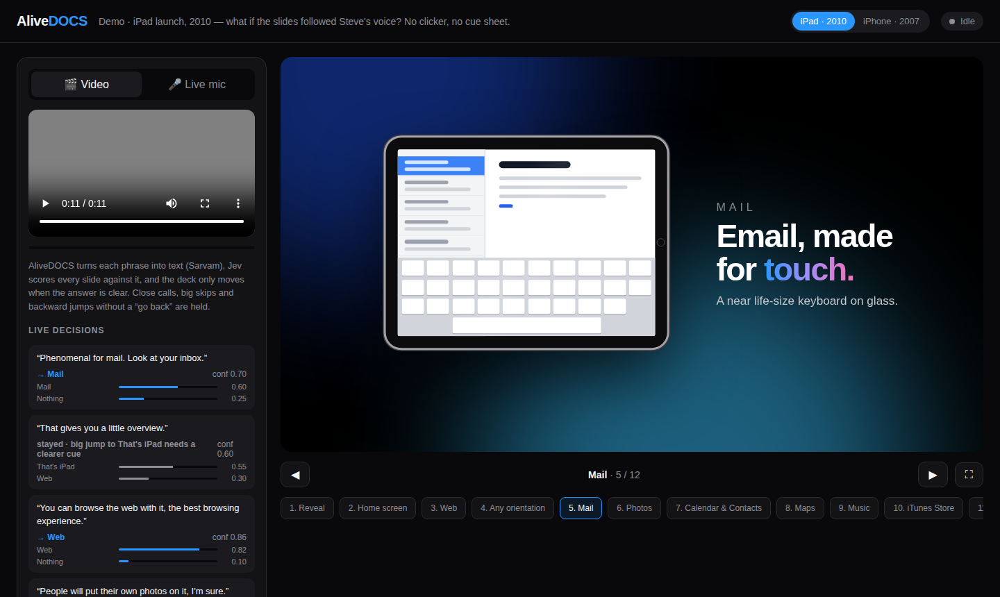

<sub>The decision feed (left) shows every phrase that was heard, where the deck went or why it held, and the two slides that were competing.</sub>

---

## Contents

- [What it does](#what-it-does)
- [How it works](#how-it-works)
- [Handling ambiguity](#handling-ambiguity)
- [The demo decks](#the-demo-decks)
- [Getting started](#getting-started)
- [Project structure](#project-structure)
- [Adding your own deck](#adding-your-own-deck)

## What it does

- **Two audio sources.** Upload a video or audio file and AliveDOCS listens to its soundtrack as it plays,
  or switch to **Live mic** and present it yourself.
- **Understands meaning, not keywords.** Each phrase is transcribed and compared against plain-language
  descriptions of every slide.
- **Knows when *not* to move.** Close calls, applause, early mentions of later topics and accidental
  recaps don't throw the deck around (see [Handling ambiguity](#handling-ambiguity)).
- **Shows its reasoning.** The live decision feed lists each phrase, the slide it chose (or why it held)
  and the probabilities of the top candidates.
- **Fully animated decks.** These are cinematic, CSS-animated scenes, not static slides.
- **Manual override always works.** Use the ◀ ▶ buttons, the arrow keys or the slide strip. There's also fullscreen.
- **Works on any screen**, from a projector down to a phone.

## How it works

```
 🎬 video soundtrack ─┐
                      ├─► alive.js ──► Sarvam ──► Jev ──► resolve() ──► deck moves (or holds)
 🎤 live microphone ──┘   phrase      speech      scores    code-side
                          detection   to text     every     ambiguity
                                                  slide     rules
```

1. **Listen** (`alive.js`). The audio is watched in the browser and cut into phrases at natural pauses
   (max 5 s each), so each request carries one complete thought.
2. **Transcribe** (`server.js`). Each phrase goes to [Sarvam](https://docs.sarvam.ai) `saaras:v4`
   speech-to-text, which handles Indian *and* global English accents.
3. **Score** (`server.js`). [Jev](https://docs.typesafe.ai), TypeSafe's "System One" decision model,
   receives the deck's slide descriptions, the current and upcoming slide, the previous phrase and the
   new one. It returns a probability for every slide, plus a yes/no answer to "is the speaker explicitly
   asking to go back?". Jev doesn't generate text. It answers typed questions, which makes it fast and
   predictable for this job.
4. **Decide** (`resolve()` in `server.js`). Plain code, not the model, makes the final call using the
   rules below.

API keys stay on the server. The browser never sees them.

## Handling ambiguity

Live speech is messy. Speakers mention things early, recap things late, and say words that fit several
slides. AliveDOCS holds its position unless the answer is clear:

| Situation | Example from the iPad clip | What happens |
|---|---|---|
| **Close call:** top two slides within 0.2 | "people will put their own photos on it" while on *Home screen* | **Holds.** The next phrase usually settles it. |
| **Big jump:** more than 2 slides ahead | "let me give you a little overview" near the start | **Holds** unless confidence ≥ 0.75 and margin ≥ 0.4 |
| **Backwards** without an explicit request | repeating "the whole webpage" while on *Any orientation* | **Holds.** It only goes back on "go back", "show that again", … |
| **Unsure or irrelevant** | applause, "um", "so…" | **Holds** (confidence < 0.5 or best answer is "nothing") |
| **"Next" vs the slide's name** | "for photos…" while on *Mail* | The "next" and "Photos" votes are **merged**, so the deck moves confidently |

Two more techniques reduce ambiguity before these rules even run:

- **Contrastive slide descriptions.** Each slide can say what it covers, what it *doesn't*, and example
  phrasings, for instance *Music* ("your own collection", not "buying in the store") vs *iTunes Store*.
- **Context.** Jev sees the previous phrase and which slide comes next in the plan.

The thresholds live together at the top of `resolve()`, and `npm test` checks the rules against the
clip's tricky moments.

## The demo decks

### iPad · 2010

One iPad stays on stage for the whole talk. It glides between positions, turns to landscape, and its
screen switches apps as the speaker moves through features, while the ambient light shifts colour with
each topic.

| | |
|---|---|
| 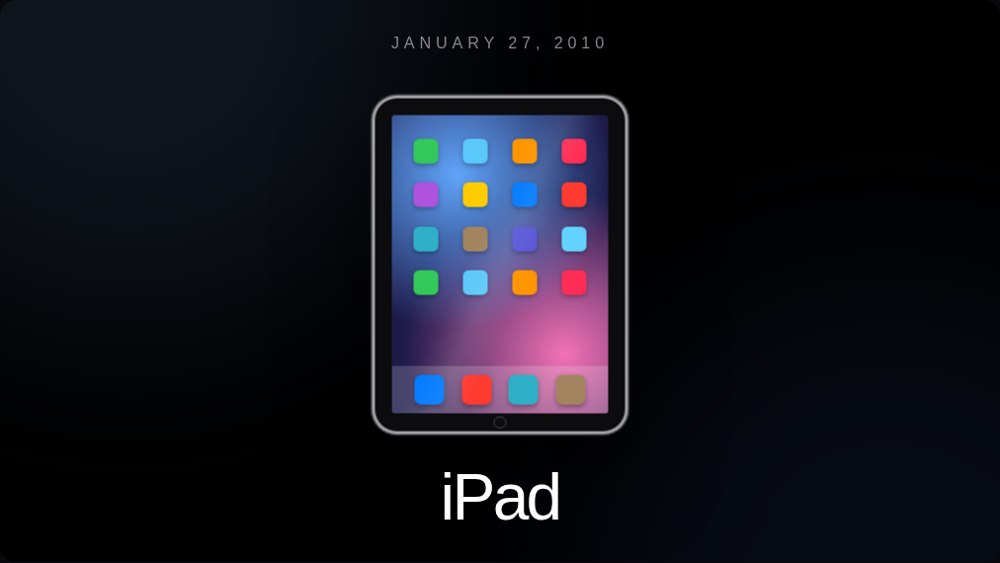 | 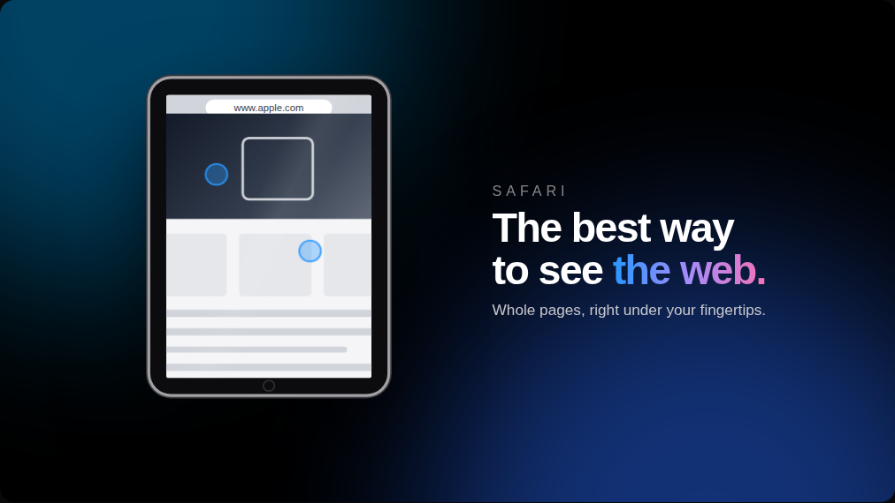 |
| **Reveal**: the device rises in and the screen lights up | **Web**: pinch-zoom on a full web page |
| 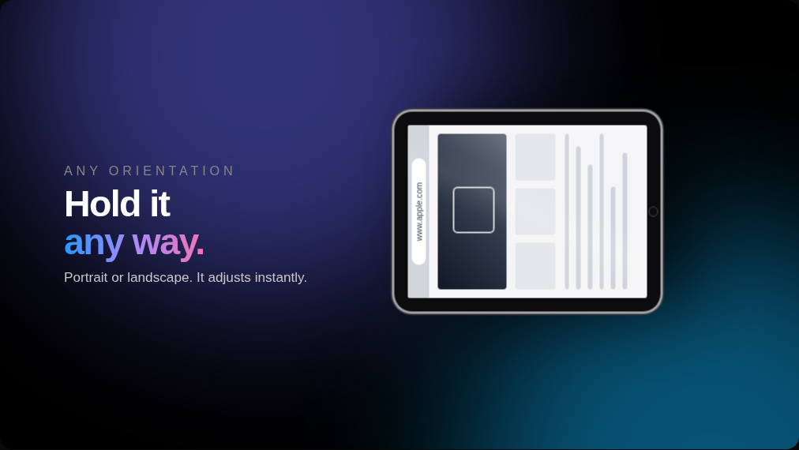 | 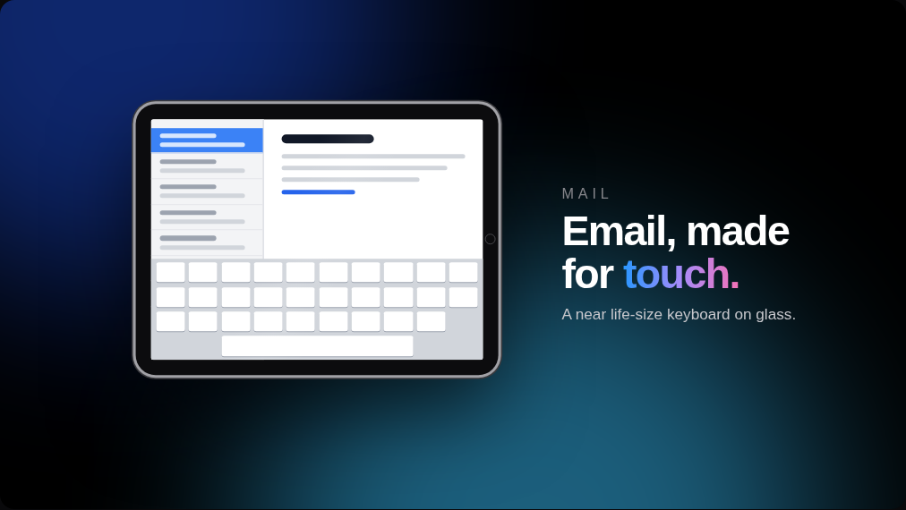 |
| **Any orientation**: the device turns sideways and back | **Mail**: the keyboard slides up and a message types itself |
| 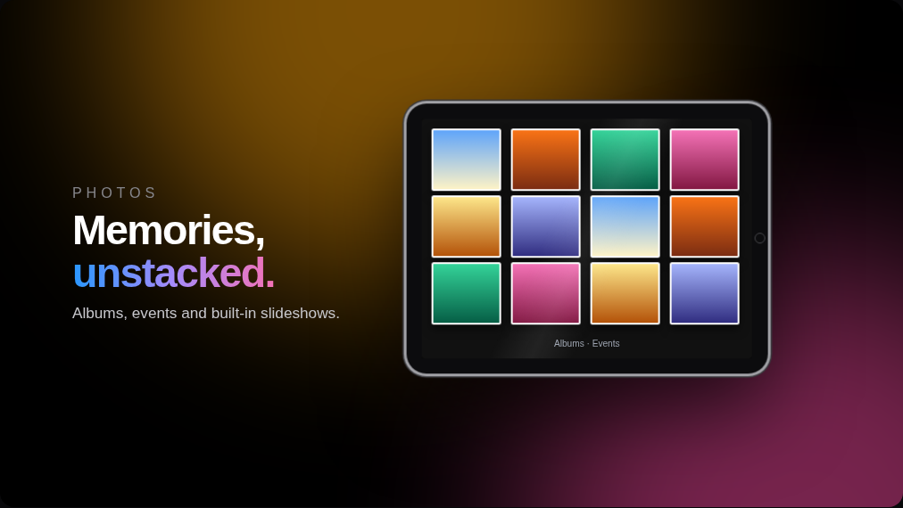 | 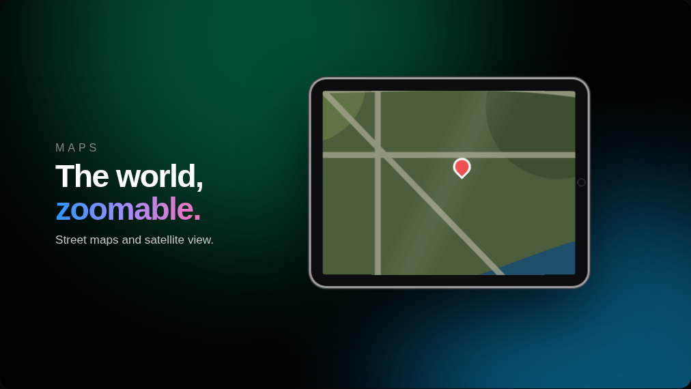 |
| **Photos**: three stacks unfold into a grid | **Maps**: pin drop, satellite crossfade, zoom |
| 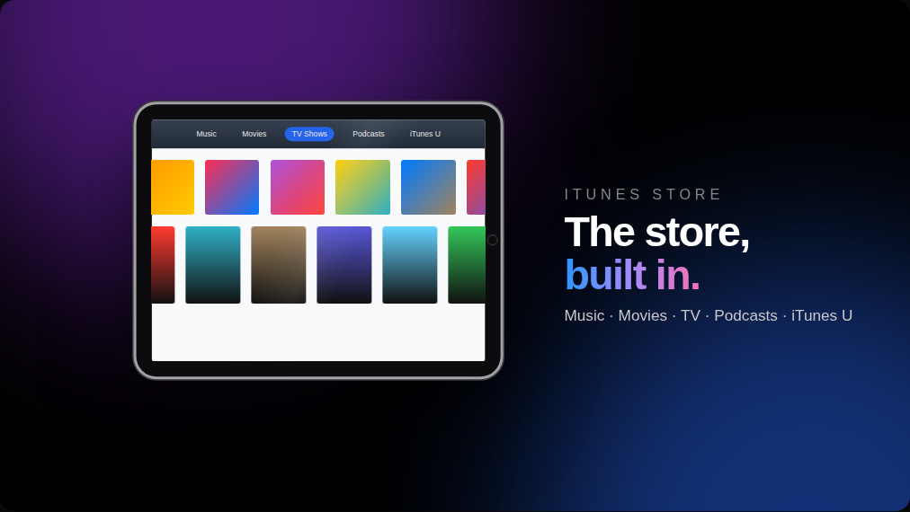 | 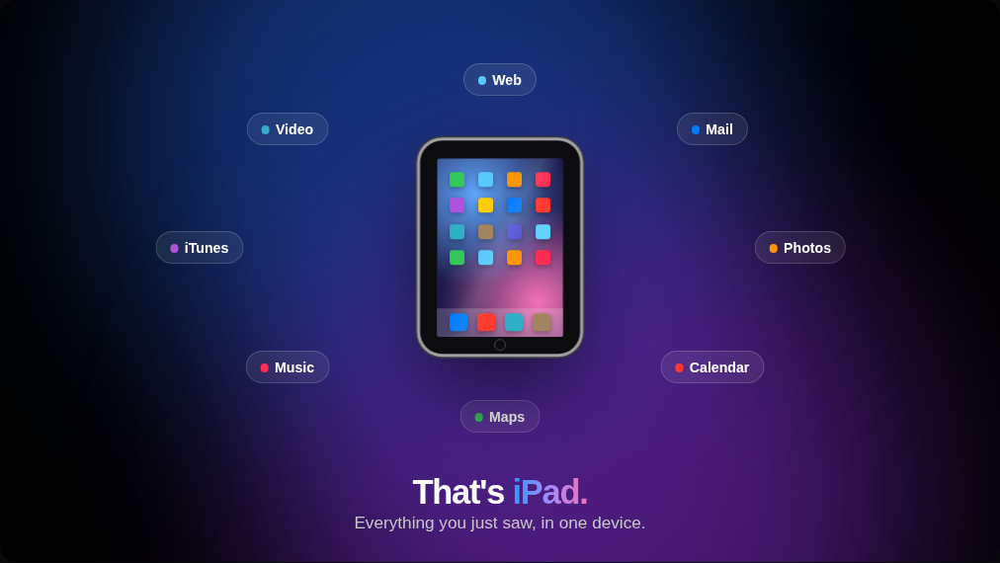 |
| **iTunes Store**: rows scroll while category tabs cycle | **That's iPad**: every feature flies out and circles the device |

All 12 beats: Reveal → Home screen → Web → Any orientation → Mail → Photos → Calendar & Contacts → Maps →
Music → iTunes Store → Video → That's iPad.

Suggested clip: [Steve Jobs announces the original iPad (3:30)](https://www.youtube.com/watch?v=eZ87BRCrh0w).
It isn't included in this repo, so upload your own copy.

### iPhone · 2007

| | |
|---|---|
| 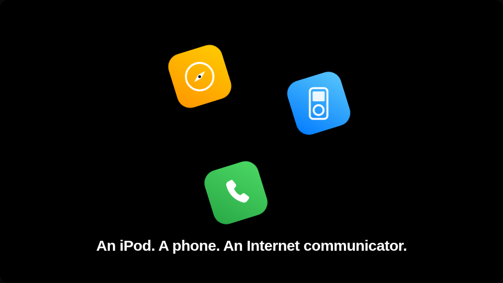 | 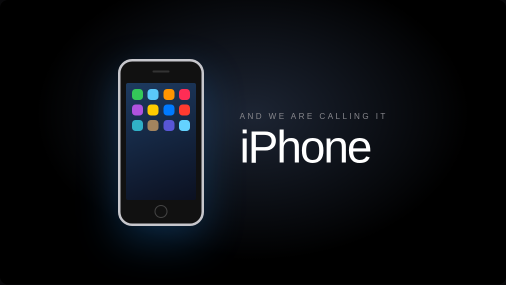 |
| **An iPod, a phone, an Internet communicator**: three icons orbit, then merge into one device | **The name reveal**: the phone rises and app icons pop in |

12 beats: Welcome → Revolution → Macintosh → iPod → Three products → Widescreen iPod → Mobile phone →
Internet → The spin → One device → iPhone → Reinvent the phone.

Suggested clip: [2007 Steve Jobs presents the first iPhone](https://www.youtube.com/watch?v=5J-47F8Hrdw).
It isn't included, so upload your own copy.

### Also included

`newton.html` is the original prototype: an illustrated story of how Newton discovered gravity, narrated
over the mic.

### On mobile

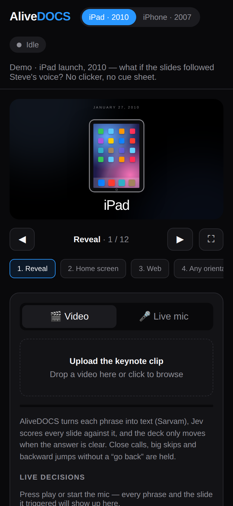

## Getting started

Requirements: **Node.js 20.12+** and API keys for **Sarvam** and **TypeSafe (Jev)**. There are no npm
dependencies.

```bash
git clone https://github.com/xreedev/AliveDOCS.git
cd AliveDOCS
cp .env.example .env      # add SARVAM_API_KEY and TYPESAFE_API_KEY
npm start
```

Open **http://localhost:3000**, then:

1. Pick a deck in the header (**iPad · 2010** or **iPhone · 2007**).
2. **Video:** drop the keynote clip into the upload area and press play.
   **Live mic:** switch tabs, click the mic and start presenting.
3. Watch the deck follow along, and the decision feed explain each move.

| Variable | Purpose |
|---|---|
| `SARVAM_API_KEY` | Sarvam speech-to-text |
| `TYPESAFE_API_KEY` | Jev slide decisions (`JEV_API_KEY` also accepted) |
| `PORT` | Optional, defaults to `3000` |

Other commands: `npm test` runs the slide-change rule tests. The Newton prototype is at
`http://localhost:3000/newton.html`.

## Project structure

```
index.html            App UI + both keynote decks (slides, animations, deck data)
alive.js              Browser listener: splits any audio stream into phrases, sends them, reports results
server.js             Static server + /listen: Sarvam transcription → Jev scoring → resolve() rules
newton.html           Original Newton prototype
test/policy.test.mjs  Ambiguity rules checked against real moments from the iPad clip
docs/screenshots/     Images used in this README
```

## Adding your own deck

A deck is just data plus markup. Every page sends its own slide list, so the server works for any talk.

1. In `index.html`, add an entry to `DECKS`:

   ```js
   mytalk: {
     label: "My talk",
     title: "A short description of the talk",   // context for Jev
     sub: "Subtitle shown in the header",
     slides: {
       intro:  ["Intro",  "Welcome, who I am, what this talk is about"],
       problem:["Problem", { what: "The problem we are solving", not_for: "Our solution", examples: ["here's what's broken"] }],
       // …in presentation order
     },
   },
   ```

2. Add a `<div class="deck" data-deck="mytalk">` to the stage, with one
   `<section class="slide" data-for="intro">…</section>` per slide (or a shared section that lists several ids).
3. Write each description the way the speaker would *talk* about that slide. Use `not_for` to separate
   slides that sound alike.

---

<sub>Demo decks are original illustrations recreating the flow of public product keynotes. Product names
belong to their owners. Keynote footage is not included in this repository.</sub>
